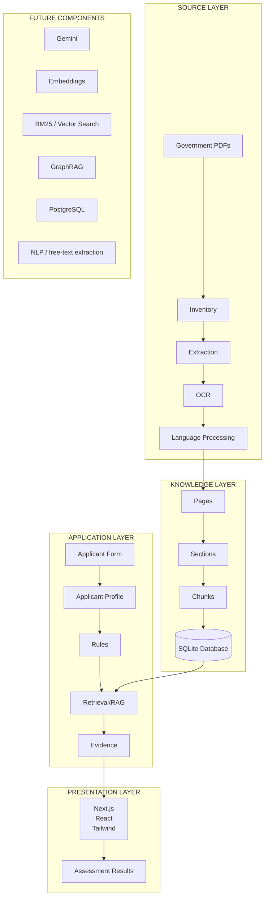
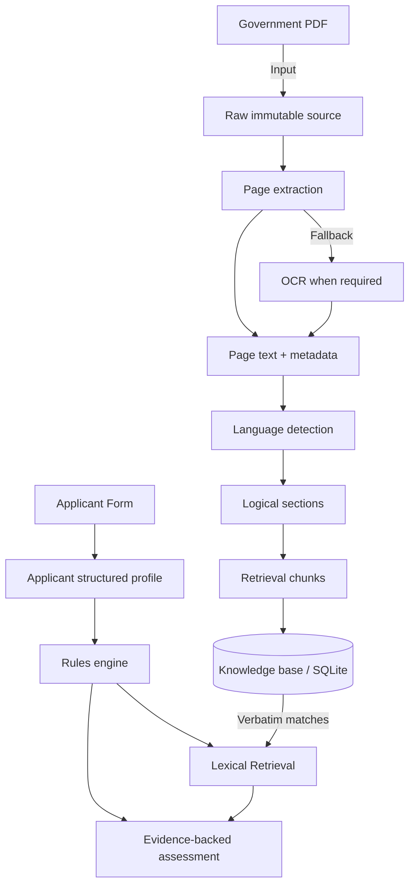

# Smart Maharashtra Single Window System

## Project Overview
The **SMSWS Policy Engine** is a modular processing pipeline and web application designed to digest Maharashtra Government documents (GRs, policies, acts) and provide an automated preliminary assessment for industrial applicants.

## What the System Is
The system consists of an offline data pipeline that extracts and chunks government PDFs into a knowledge base (SQLite), and a live application that uses deterministic rules and lexical retrieval (RAG) to assess applicant eligibility and provide evidence-backed recommendations.

## Core Architecture Principle
> [!IMPORTANT]
> **RULES DECIDE.**
> **AI EXTRACTS.**
> **RAG EXPLAINS.**
> **SOURCES REMAIN AUTHORITATIVE.**

The final eligibility evaluation is calculated using strict, deterministic rule logic. LLMs are restricted solely to offline extraction. The live MVP treats the SQLite database as read-only.

## Current Architecture



## Complete Data Flow



## Current Data Pipeline
1. **PDF**: Raw files sit in `data/raw_pdfs/`.
2. **Extraction**: `PyMuPDF` attempts native text extraction.
3. **OCR**: If native extraction yields < 100 characters, Tesseract OCR is applied.
4. **Language**: Page-level language detection categorizes pages as EN, MR, HI, or unknown.
5. **Sections**: Contiguous English pages are grouped into sections.
6. **Chunks**: English sections are semantically chunked.
7. **Database**: Everything is immutably stored in `policy_engine.db`.

## Current Application Flow
1. **Applicant form**: User enters data in a 5-step Next.js wizard.
2. **Structured profile**: Data is cast into a strongly typed `ApplicantProfile`.
3. **Assessment**: `src/rules.py` evaluates deterministic business rules.
4. **Retrieval/rules**: Candidate policies trigger lexical keyword searches via `src/retrieval.py`.
5. **Evidence**: Matched chunks are surfaced as verbatim source evidence alongside the assessment.

## Repository Structure
- `db/`: SQLite database and schema.
- `frontend/`: Next.js applicant wizard and results UI.
- `src/`: Python backend (pipeline, rules, API).
- `tests/`: Comprehensive pytest test suite.
- `references/`: Corpus manifest.
- `data/raw_pdfs/`: Original PDF documents.
- `inspection_report/`: Generated HTML/MD reports verifying data state.

## Database Architecture
- `documents`: Metadata, processing status (EXTRACTED, FAILED, DEFERRED), and file details.
- `document_pages`: Page-level text, extraction method (pymupdf, ocr), and language.
- `english_sections`: Identifies contiguous English page ranges for targeted chunking.
- `source_chunks`: Semantic text chunks with lineage to source documents and pages.
- `gemini_jobs`: Scaffolding for LLM processing jobs (currently empty).

## PDF Corpus
*Verified Current Statistics:*
- **Manifest Count**: 122 files.
- **Registered Documents**: 110.
- **Processing Status**: 87 EXTRACTED, 22 FAILED, 1 DEFERRED.

## Extraction & OCR
- **Extraction**: Native PyMuPDF extraction is fully implemented (2903 pages).
- **OCR**: Tesseract OCR is implemented as a fallback (150 successful pages, 122 failed). Failure reasons are recorded and can be retried using `--retry-failed-ocr`.

## Multilingual Processing
- **Implemented**: Page-level language detection successfully categorizes pages into EN (1906), MR (917), and HI (10).
- **English Isolation**: The pipeline isolates contiguous English sections and focuses chunking efforts there, currently ignoring Marathi-only documents.

## Chunking & Provenance
- **Implemented**: Semantic chunking is applied to English sections (1477 chunks).
- **Provenance**: Lineage is strictly maintained. Every chunk in the database includes its source `document_id` and `page_start`, ensuring that surfaced evidence always maps to an authoritative PDF page.

## Verification & Testing
- **What was tested**: Backend models, rule logic, lexical retrieval integration, API endpoints, and database invariants.
- **DB Statistics Verification**: verified via `src/inspection.py` which runs strictly read-only queries against SQLite to compute pages, languages, OCR rates, and chunks.
- **Invariants**: Declared pages vs stored pages, chunks per page, and Gemini jobs must be 0 (enforced by tests).
- **Inspection**: The `inspection.py` script generates an HTML report detailing document-by-document status and surfaces quality warnings (e.g., "0 chunks produced", "More than half pages unknown language").
- **OCR failures**: Sourced from `extraction_method = 'ocr_failed'` and clearly reported in the inspection summary.
- **Tests passed**: 71 backend pytest tests passing.

## Current Implementation Status
| Component | Status |
| :--- | :--- |
| PDF Inventory & Extraction | **IMPLEMENTED** |
| Multilingual Processing | **IMPLEMENTED** |
| Chunking & Provenance | **IMPLEMENTED** |
| Database Architecture | **IMPLEMENTED** (SQLite) |
| Inspection / Reporting | **IMPLEMENTED** |
| Rules Engine | **IMPLEMENTED** |
| Lexical Retrieval (Basic RAG) | **IMPLEMENTED** |
| API Backend | **IMPLEMENTED** |
| Next.js Frontend Wizard | **IMPLEMENTED** |
| Vector Search (Embeddings) | **ABSENT** |
| Gemini Processing | **ABSENT** (Scaffold exists) |

## Project Evolution / Change History
- **PHASE 1 (Confirmed)**: Initial ingestion architecture (PyMuPDF, basic SQLite).
- **PHASE 2 (Confirmed)**: Added OCR fallback and page-level Multilingual processing.
- **PHASE 3 (Confirmed)**: Real corpus ingestion; database populated with 110 documents.
- **PHASE 4 (Confirmed)**: Codex AI added the HTML inspection/reporting layer to verify the database state.
- **PHASE 5 (Confirmed)**: Application layer built, including FastAPI backend, Next.js frontend, deterministic rules, and lexical RAG.

## Engineering Decisions
1. **Rules Decide, AI Extracts**: The assessment logic uses hardcoded rules. LLMs do not hallucinate eligibility.
2. **Sources Remain Unchanged**: The raw government PDFs are never modified.
3. **Lexical Retrieval First**: Implemented simple keyword search over SQLite for the MVP instead of managing a vector DB.
4. **Page-level Language Detection**: Ensures RAG chunks don't mix English and Marathi haphazardly.

## Known Issues
- 12 PDFs from the manifest are missing/unregistered in the DB.
- 22 documents failed extraction (122 pages failed OCR).
- Lexical retrieval is basic and may miss semantically similar but keyword-divergent evidence.

## Deferred Work
- Migration from SQLite to PostgreSQL.
- Implementation of Vector embeddings / BM25 search.
- LLM (Gemini) driven rule extraction from PDFs.

## Future Architecture
*PLANNED / FUTURE:*
- **Gemini**: For complex offline structuring of Marathi policies.
- **Embeddings & Vector Search**: For accurate semantic retrieval.
- **GraphRAG**: For entity relationships across multiple policies.
- **PostgreSQL**: For production data scaling.

## Running the Project
**Backend:**
```powershell
& ".\.venv-win\Scripts\Activate.ps1"
python -m uvicorn src.api.main:app --reload --port 8000
```
**Frontend:**
```powershell
cd frontend
npm install
npm run dev
```

## Running the Inspection
Generates HTML and Markdown reports in `inspection_report/`:
```powershell
python -m src.inspection
```

## Running Tests
Executes the comprehensive backend test suite:
```powershell
& ".\.venv-win\Scripts\pytest.exe" tests/ -v
```

## Demo
The demo is fully functional locally. A user navigates through the 5-step Next.js wizard, submitting entity and project details. The backend responds with an assessment detailing potentially applicable policies (e.g., Textile Policy, EV Policy), required approvals (e.g., MAITRI, Environmental Clearance), and verbatim text evidence pulled from the local SQLite database.
